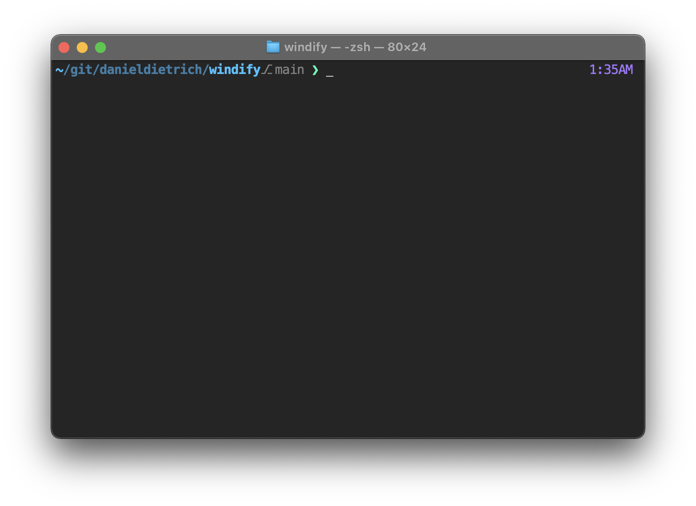

<!-- markdownlint-disable MD034 -->

# ❯_ gitprompt

A beautiful git prompt for zsh and bash.

## Features

* 256 colors support
* Show current directory
* Show git branch, status and push state
* Show current time at the right side (zsh only)
* Automatic PROMPT refresh on git changes and time (every second, zsh only)

## Usage

| Szenario  |               Command             |                     Description                   |
| --------- | --------------------------------- | ------------------------------------------------- |
| ad-hoc    | `. <(curl gitprompt.sh)`          | Use **gitprompt** in the current terminal session |
| permanent | `curl gitprompt.sh/install \| sh` | Install **gitprompt** in your home directory      |
| [dotfiles](https://www.gitpod.io/docs/configure/user-settings/dotfiles) | `https://github.com/danieldietrich/dotfiles` | Personalize your Gitpod workspace environments |

## Customization

ENV variables can be set in your `.bashrc` or `.zshrc` file.

|         ENV var         |     Default    |           Description          |
| ----------------------- | -------------- | ------------------------------ |
| `GP_COLOR_PROMPT`       | `"38;5;49"`    | Prompt color                   |
| `GP_COLOR_GIT_BRANCH`   | `"38;5;8"`     | Branch color                   |
| `GP_COLOR_GIT_STATUS`   | `"38;5;9"`     | Dirty state color              |
| `GP_COLOR_GIT_UNPUSHED` | `"38;5;11"`    | Unpushed state color           |
| `GP_COLOR_PWD_DARK`     | `"1;38;5;24"`  | Directory color dark           |
| `GP_COLOR_PWD_LIGHT`    | `"1;38;5;39"`  | Directory color light          |

These variables only apply to the zsh version.

|         ENV var         |     Default    |           Description          |
| ----------------------- | -------------- | ------------------------------ |
| `GP_COLOR_CLOCK`        | `"38;5;99"`    | Clock color                    |
| `GP_COLORS`             | `true`         | Enable colors                  |
| `GP_UPDATE_PROMPT`      | `true`         | Enables/disables PROMPT update |
