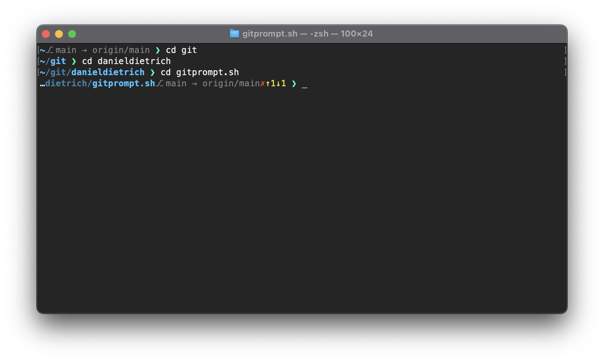

<!-- markdownlint-disable MD034 -->

# ❯_ gitprompt

A beautiful git prompt for zsh and bash.

## Features

* 256 colors support
* Show current directory
* Show git branch, status and push state

## Usage

| Szenario  |               Command             |                     Description                   |
| --------- | --------------------------------- | ------------------------------------------------- |
| ad-hoc    | `. <(curl gitprompt.sh)`          | Use **gitprompt** in the current terminal session |
| permanent | `curl gitprompt.sh/install \| sh` | Install **gitprompt** in your home directory and alter the PATH. |
| manual    | `curl -sL https://gitprompt.sh > "$HOME/.gitprompt"` | Download **gitprompt** to your home directory. Load it by running `. ~/.gitprompt &>/dev/null` |

For customization see [.gitprompt](./docs/index.html) file.
