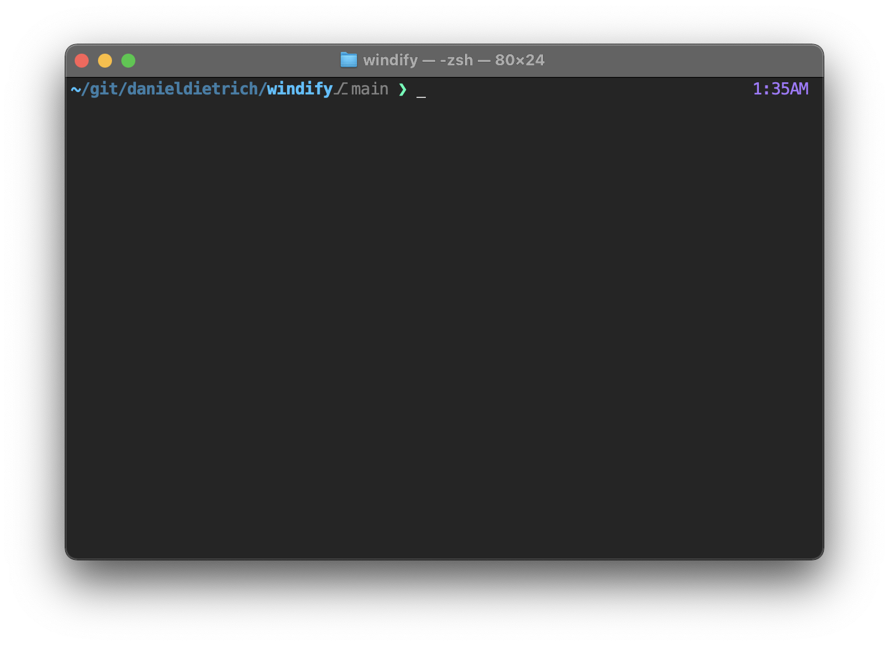

# ❯_ git prompt



Use git prompt **ad-hoc** by sourcing the script:

```sh
source <(curl gitprompt.sh)
```

Use git prompt **permanently** by running the installer:

```sh
curl gitprompt.sh/install | sh
```
